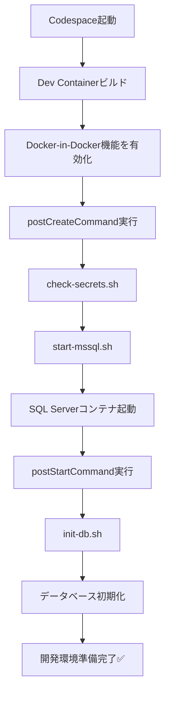

# Docker-in-Docker 構成への移行完了 ✅

## 🎯 変更内容

**問題:** Docker Composeを使った複数サービス構成がCodespacesで動作しない

**解決:** Docker-in-Dockerを使用してCodespace内でSQL Serverコンテナを起動

## 📋 実装した変更

### 1. devcontainer.json
- ❌ 削除: `dockerComposeFile`, `service`, `runServices`
- ✅ 追加: `features.docker-in-docker` (Dockerコンテナ内でDockerを実行可能に)
- ✅ 変更: `postCreateCommand` で `start-mssql.sh` を実行

### 2. 新規スクリプト: start-mssql.sh
SQL Serverコンテナを自動起動:
- Dockerデーモンの準備完了を待機
- `mssql` コンテナの存在チェック
- 存在しなければ新規作成、存在すれば起動
- SQL Serverの準備完了を確認（60秒リトライ）

### 3. init-db.sh の更新
- ❌ 削除: `mssql` ホスト名の解決チェック
- ✅ 変更: `localhost` への接続に変更
- ✅ 改善: より詳細なエラーメッセージ

### 4. manual-init.sh の更新
- ✅ 追加: mssqlコンテナの自動起動機能
- ✅ 変更: `localhost` 接続に対応

### 5. ドキュメント更新
- [CODESPACE_SETUP.md](../CODESPACE_SETUP.md): Docker-in-Docker構成の説明を追加
- トラブルシューティングセクションを全面刷新

## 🚀 動作フロー



## 🔧 アーキテクチャ

```
┌─────────────────────────────────────────┐
│     GitHub Codespace (Cloud VM)         │
│  ┌───────────────────────────────────┐  │
│  │   Dev Container (workspace)       │  │
│  │   ┌─────────────────────────────┐ │  │
│  │   │  Java/Maven環境              │ │  │
│  │   │  sqlcmd ツール                │ │  │
│  │   │  Spring Boot アプリ          │ │  │
│  │   └─────────────────────────────┘ │  │
│  │                                     │  │
│  │   ┌─────────────────────────────┐ │  │
│  │   │  Docker Daemon (DinD)       │ │  │
│  │   │  ┌───────────────────────┐  │ │  │
│  │   │  │ SQL Server Container  │  │ │  │
│  │   │  │ (mssql)               │  │ │  │
│  │   │  │ Port: 1433            │  │ │  │
│  │   │  │ DB: pct901s           │  │ │  │
│  │   │  └───────────────────────┘  │ │  │
│  │   └─────────────────────────────┘ │  │
│  └───────────────────────────────────┘  │
└─────────────────────────────────────────┘
         ↓ localhost:1433
    Spring Boot ← → SQL Server
```

## ✅ 次のステップ

### 今すぐ試す

**現在のCodespaceで試す:**
```bash
# SQL Serverを手動起動
bash .devcontainer/start-mssql.sh

# データベース初期化
bash .devcontainer/manual-init.sh

# 確認
docker ps
sqlcmd -S localhost -U SA -P "$MSSQL_SA_PASSWORD" -Q "SELECT name FROM sys.databases;"
```

**推奨: Codespaceを再ビルド**
```
Cmd/Ctrl + Shift + P → "Dev Containers: Rebuild Container"
```
これにより全自動でセットアップされます。

## 📝 旧構成との比較

| 項目 | 旧構成 (docker-compose) | 新構成 (Docker-in-Docker) |
|------|-------------------------|---------------------------|
| **SQL Server起動** | 別サービスとして起動 | コンテナ内で起動 |
| **接続先** | `mssql:1433` | `localhost:1433` |
| **Codespacesサポート** | ❌ 動作しない | ✅ 動作する |
| **セットアップ** | docker-compose.yml | start-mssql.sh |
| **ネットワーク** | devnet (bridge) | ホストネットワーク |
| **起動確認** | ヘルスチェック | スクリプト内でリトライ |

## 🐛 既知の制限事項

1. **データ永続化なし**
   - Codespace削除時にデータも消える
   - 開発環境としては問題なし

2. **リソース消費**
   - Dockerコンテナが追加のメモリ/CPUを使用
   - Codespacesの無料枠に注意

3. **パフォーマンス**
   - Docker-in-Dockerによる若干のオーバーヘッド
   - 開発用途では問題ないレベル

## 🔗 関連ファイル

- [devcontainer.json](devcontainer.json) - Dev Container設定
- [start-mssql.sh](start-mssql.sh) - SQL Server起動スクリプト
- [init-db.sh](init-db.sh) - データベース初期化スクリプト
- [manual-init.sh](manual-init.sh) - 手動初期化スクリプト
- [CODESPACE_SETUP.md](../CODESPACE_SETUP.md) - セットアップガイド
